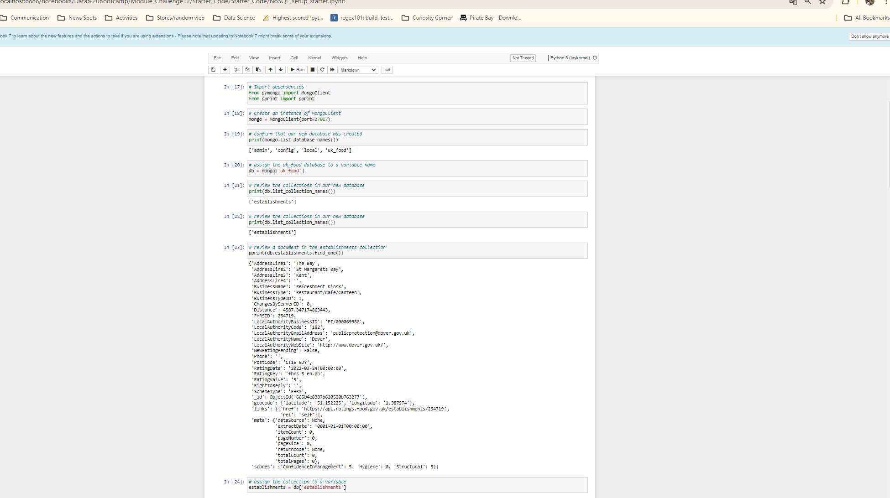

# nosql-challenge

Confirm that you created the database and loaded the data.

List the databases you have in MongoDB. Confirm that uk_food is listed.
List the collection(s) in the database to ensure that establishments is there.
Find and display one document in the establishments collection using find_one and display with pprint.
Assign the establishments collection to a variable to prepare the collection for use.

