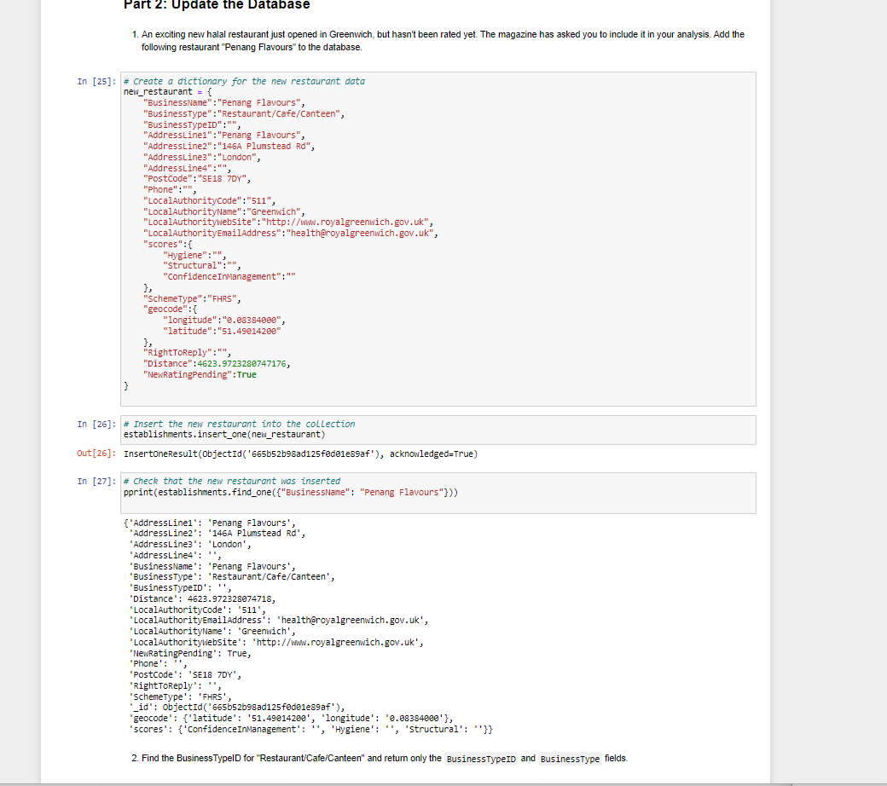

# nosql-challenge

Confirm that you created the database and loaded the data.

List the databases you have in MongoDB. Confirm that uk_food is listed.
List the collection(s) in the database to ensure that establishments is there.
Find and display one document in the establishments collection using find_one and display with pprint.
Assign the establishments collection to a variable to prepare the collection for use.

Use NoSQL_setup_starter.ipynb for this section of the challenge.

The magazine editors have some requested modifications for the database before you can perform any queries or analysis for them. Make the following changes to the establishments collection:

An exciting new halal restaurant just opened in Greenwich, but hasn't been rated yet. The magazine has asked you to include it in your analysis. Add the following information to the database:

